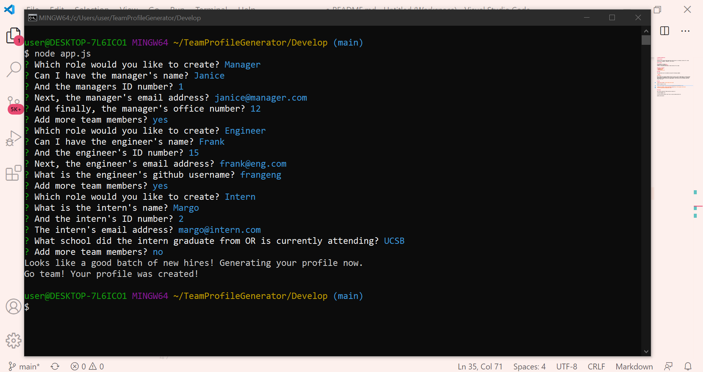
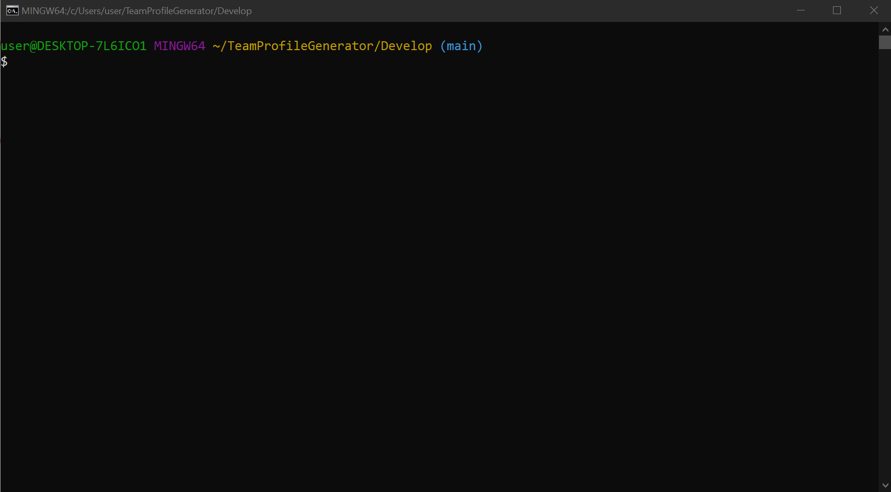
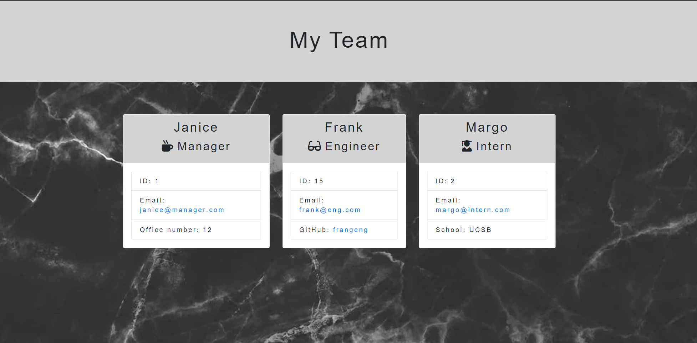

# TeamProfileGenerator

## Description

An easy to use console based application that assists in creating a profile for a team consisting of managers, engineers, and interns.

## User Story

AS A member of a team <br>
I WANT a profile generator<br>
SO THAT I can quickly and easily create profiles for my team.


## Table of Contents
* [Usage](#usage)
* [Demo](#demo)
* [Contact](#contact)

## Usage

The application will be invoked by using the following command:

```bash
node app.js
```
Once invoked, the console prompts the user to pick a role to input data for. Each role has unique questions depending on the job and when information on each employee is submitted, the creation a robust team profile page begins! This profile will be already styled and ready to go live!


## Demo



Video of project in use:

https://drive.google.com/file/d/1lv6_WArt8XaeNexAZJSS75LQqRibRDac/view

[](https://drive.google.com/file/d/1lv6_WArt8XaeNexAZJSS75LQqRibRDac/view)



When the team.html file is viewed in browser, the team profile will be styled as above.


## Contact

Any further questions? Please send me an email at:

itsalexkelly@gmail.com

To view my other projects feel free to view my Github profile at:

github.com/luvwitch
